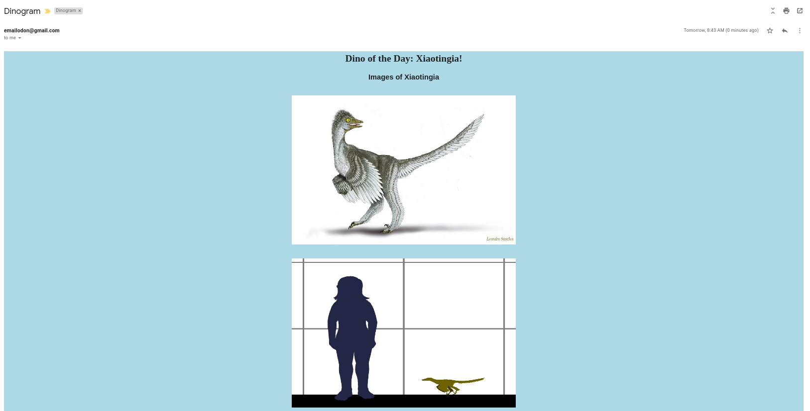
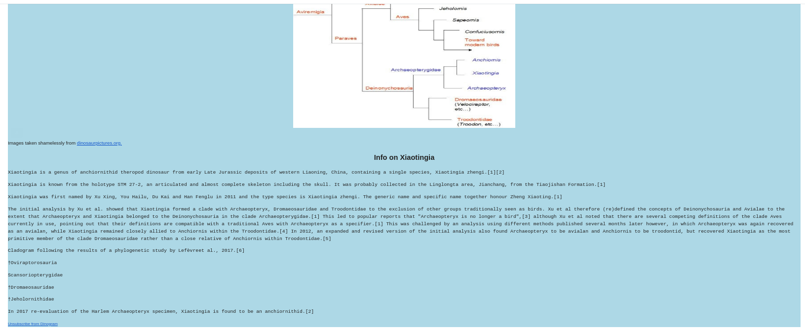

<h1>
    Dino of the Day
</h1>

This is the tracking repository for <a href="https://dinogram.org">Dinogram</a>, an informative newsletter on dinosaurs. The project was motivated by my girlfriend expressing an interest in learning more about dinosaurs. I decided it would be a fun excuse to implement some web-scraping data gathering techniques so I wrote this application to gather images of a specific dinosaur and its associated Wikipedia article and send those to her once a day. She expressed interest in signing up some friends and the application grew into the current version of Dinogram!

 Application Features 

<ul>
    
    <li>Python Selenium+Geckodriver web crawler used to navigate JS page</li>
    <li>SMTP mailing program interacting with MongoDB to mail newsletter to all subscribed users</li>
    <li>ReactJS+ExpressJS web application to allow users to sign up friends for the newsletter and unsubscribe</li>

</ul>

 Images of the Dinogram 

The email layout is quite basic but sends all of the pictures for a specific dinosaur that are available on the <a href="https://dinosaurpictures.org">Dinosaur Pictures</a> website.

Along with images of the dinosaur, the program finds all of the information on that dinosaur available on Wikipedia and sends that along.

